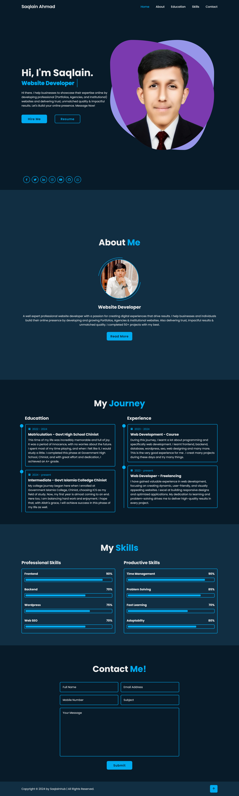

# Portfolio Website Practice

This cloned website is a practice project where I focused on replicating a professional design to sharpen my development skills. While inspired by an existing website, I've implemented enhancements and personalized elements to demonstrate my creativity and technical expertise. This project highlights my ability to analyze, recreate, and improve designs effectively.
This website is created by using:
- Html5
- Bootstrap
- JavaScript

I created this website on <b> August 2024 </b>, as a role of <b>coding</b>. 

